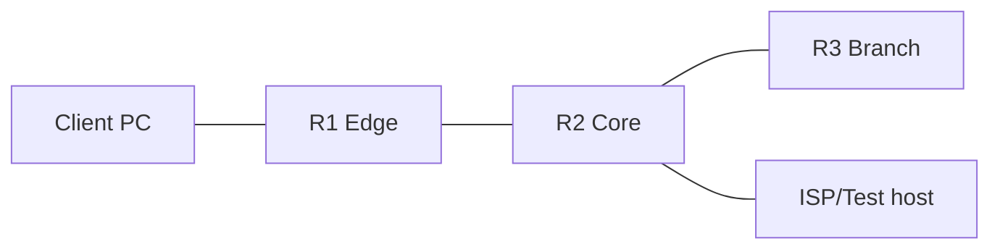

# 02 — Build a Safe RouterOS Lab

## Why a lab is mandatory

RouterOS knowledge becomes durable when you can see the resulting route, neighbor, counter, or packet. A lab also gives you permission to fail. Never make your first attempt at VLAN filtering, OSPF redistribution, BGP policy, or an input firewall on a production router.

## Choose a platform

| Option | Best for | Strengths | Limits |
|---|---|---|---|
| Physical RouterBOARD | hardware behavior, wireless, switch chip, PoE | realistic interfaces and offload | costs money; recovery may require cable/Netinstall |
| CHR on VirtualBox/VMware/Hyper-V | beginners | simple, local, snapshots | virtual switching varies by hypervisor |
| GNS3/EVE-NG/PNETLab with CHR | multi-router labs | topology view, links, captures | more setup and CPU/RAM |
| Containerized RouterOS | reproducible advanced labs | fast automation | feature/licensing/platform constraints; not the beginner path |

CHR is MikroTik's Cloud Hosted Router image for virtual machines. Follow MikroTik's current download and license terms. The free license is suitable for learning but has throughput limits.

## Workstation requirements

For the full topology, plan for:

- 4 CPU threads or more;
- 8 GB RAM or more;
- 12 GB free disk;
- one isolated virtual network with no bridge to a production LAN;
- current WinBox;
- Wireshark for packet capture;
- a text editor and Git.

Three small CHRs can run with modest memory. The MTCINE service-provider topology uses six and benefits from more resources.

## Golden lab topology



Address plan:

| Link/network | Prefix | R1 | R2 | R3/client |
|---|---|---|---|---|
| Client LAN | `192.168.10.0/24` | `.1` | — | PC `.10` |
| R1–R2 | `10.0.12.0/30` | `.1` | `.2` | — |
| R2–R3 | `10.0.23.0/30` | — | `.1` | R3 `.2` |
| Branch LAN | `192.168.30.0/24` | — | — | R3 `.1` |
| R2–ISP | `198.51.100.0/30` | — | `.1` | ISP `.2` |
| Loopbacks | `/32` | `10.255.0.1` | `10.255.0.2` | `10.255.0.3` |

Link-to-interface mapping:

| Router | ether1 | ether2 | ether3 | ether4 |
|---|---|---|---|---|
| R1 | management/NAT cloud | R1–R2 | Client LAN | spare |
| R2 | management/NAT cloud | R1–R2 | R2–R3 | ISP |
| R3 | management/NAT cloud | R2–R3 | Branch LAN | spare |

Your emulator may number interfaces differently. Document the mapping before configuring IP addresses.

## First boot procedure

Perform these steps on one CHR before cloning it:

1. Attach only a management/NAT adapter.
2. Boot and log in through the hypervisor console.
3. Set a strong temporary lab password.
4. Confirm package, architecture, version, license, disk, and interfaces.
5. Upgrade only after reading the current changelog.
6. Shut down cleanly and take a “clean-version” snapshot.

Useful commands:

```routeros
/system resource print
/system package print
/system license print
/interface ethernet print detail
/system routerboard print
```

CHR normally has no RouterBOARD hardware, so `/system routerboard` behavior differs from physical devices. That difference is expected.

## Reset for repeatable labs

For isolated CHRs only:

```routeros
/system reset-configuration no-defaults=yes skip-backup=yes
```

This erases the active configuration and removes the default firewall. It is dangerous on a remote or production device. After reboot, use the VM console or MAC-WinBox to regain access.

Then establish identity and a non-default administrator:

```routeros
/system identity set name=R1
/user add name=netadmin group=full password="REPLACE-IN-LAB"
/user disable admin
```

Do not commit real passwords. Configuration samples use placeholders.

## Baseline management configuration

On R1, adapt the management address to your host-only network:

```routeros
/ip address add address=192.0.2.11/24 interface=ether1 comment="lab management"
/ip service set telnet disabled=yes
/ip service set ftp disabled=yes
/ip service set www disabled=yes
/ip service set api disabled=yes
/ip service set api-ssl disabled=yes
/ip service set ssh address=192.0.2.0/24
/ip service set winbox address=192.0.2.0/24
```

Explanation:

- the management address is on documentation space here; use the actual isolated host-only range in your hypervisor;
- unused plaintext or unauthenticated management surfaces are disabled;
- allowed-source restrictions reduce exposure but do not replace input-chain firewall policy;
- if you set the wrong source subnet remotely, you can lock yourself out—use the console and Safe Mode.

## Save, clone and label

Before cloning:

```routeros
/export show-sensitive=no file=clean-baseline
/system backup save name=clean-baseline password="REPLACE-IN-LAB"
```

The export is readable and portable but omits some sensitive values. A binary backup is intended for restoring the same device/version context and may include sensitive state. Keep both protected.

After cloning, give each VM a unique identity, MAC address, and management IP. Duplicate MACs cause intermittent, confusing Layer 2 failures.

## Packet-capture options

1. Capture the virtual link in GNS3/EVE-NG.
2. Mirror a physical switch port and use Wireshark.
3. Use RouterOS Packet Sniffer:

```routeros
/tool sniffer set filter-interface=ether2 filter-ip-protocol=icmp \
    file-name=lab-icmp.pcap
/tool sniffer start
# generate traffic
/tool sniffer stop
/file print where name~"lab-icmp"
```

Download the PCAP and inspect Ethernet, IP, ICMP, TTL, and checksums. Remove captures when finished; limited router storage can fill quickly.

## Snapshot discipline

Create snapshots at these points:

- clean RouterOS version;
- basic IP reachability;
- MTCNA completed;
- MTCRE pre-OSPF;
- MTCINE IGP complete, before BGP/MPLS.

A snapshot is not a substitute for learning rollback. First use Safe Mode and exports; use snapshots to reset the entire exercise.

## Lab evidence template

For every lab, keep a short Markdown note:

```text
Requirement:
Prediction:
Configuration:
Verification commands:
Observed output:
Injected fault:
Root cause:
Fix:
Rollback:
```

The “prediction” and “root cause” fields matter more than a screenshot of a green interface.

## Checkpoint

Before Chapter 3:

- boot three clean CHRs;
- connect through console and WinBox;
- prove that each virtual cable connects the intended interfaces;
- export each configuration without secrets;
- capture one ICMP exchange;
- restore a snapshot after intentionally deleting an address.
