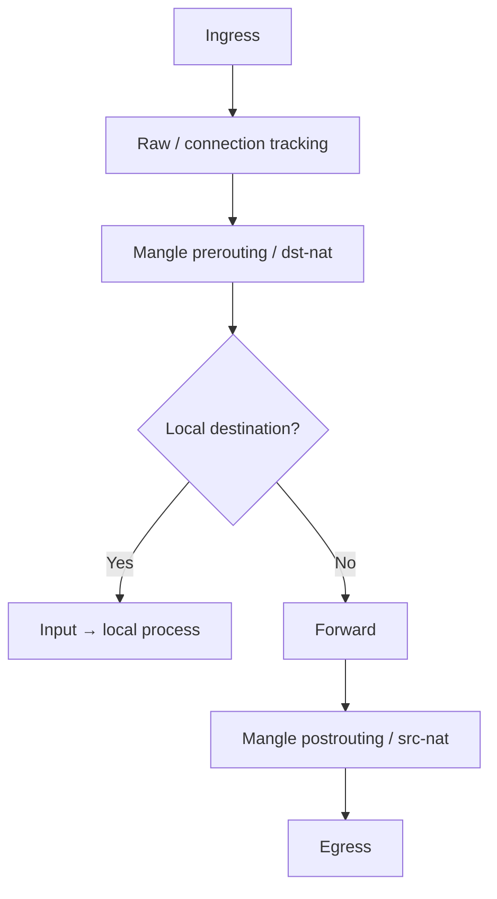

# 08 — Packet Flow, Connection Tracking, Firewall and NAT

Firewall rules become understandable when you first ask: **Is this packet addressed to the router, passing through it, or generated by it?**

## 1. The three essential filter chains

| Chain | Packet relationship | Example |
|---|---|---|
| `input` | destination is the router itself | WinBox, DNS to router, ping router |
| `forward` | router forwards between interfaces | LAN client to Internet |
| `output` | created by a router process | router DNS request or ping |

Opening `forward` does not permit WinBox to the router. Opening `input` does not allow clients to traverse the router.

## 2. Simplified IPv4 routed packet path



The complete path has bridging, routing, local output, queues, IPsec, FastTrack, and MPLS branches. Use the official packet-flow diagrams for exact advanced behavior. The simplified view is enough to place basic input, forward, dst-NAT, and src-NAT rules.

## 3. Stateful connection tracking

Connection tracking groups packets into flows and tracks protocol state. Common states:

- `new`: first packet or no established state yet;
- `established`: belongs to a known two-way flow;
- `related`: new flow related to an existing one, such as some ICMP errors;
- `invalid`: cannot be associated consistently;
- `untracked`: intentionally bypassed in raw/notrack design.

```routeros
/ip firewall connection print detail
/ip firewall filter print stats
```

State is not the same as TCP flags, and UDP can be tracked despite having no TCP-style handshake.

## 4. Rule processing and order

Rules in a chain are evaluated top to bottom until a terminating action matches. Counters are evidence.

Safe baseline structure:

```routeros
/ip firewall filter
add chain=input action=accept connection-state=established,related,untracked \
    comment="INPUT 10 accept established/related"
add chain=input action=drop connection-state=invalid comment="INPUT 20 drop invalid"
add chain=input action=accept protocol=icmp comment="INPUT 30 allow essential ICMP"
add chain=input action=accept in-interface-list=LAN src-address-list=MGMT-SOURCES \
    comment="INPUT 40 management"
add chain=input action=drop comment="INPUT 99 default deny"
```

Create the address list before depending on it:

```routeros
/ip firewall address-list add list=MGMT-SOURCES address=192.168.10.0/24 \
    comment="authorized management LAN"
```

Why established/related is early: return traffic for permitted sessions should not be re-evaluated as if each packet were a new request. Why invalid is dropped: it is inconsistent with tracked state. Why the final drop is last: anything below it is unreachable.

## 5. Protecting forwarded networks

```routeros
/ip firewall filter
add chain=forward action=accept connection-state=established,related,untracked \
    comment="FWD 10 return traffic"
add chain=forward action=drop connection-state=invalid comment="FWD 20 invalid"
add chain=forward action=accept in-interface-list=LAN out-interface-list=WAN \
    comment="FWD 30 users to Internet"
add chain=forward action=accept in-interface-list=WAN connection-nat-state=dstnat \
    comment="FWD 40 published services only"
add chain=forward action=drop comment="FWD 99 default deny"
```

This does not automatically allow inter-VLAN traffic. Add explicit least-privilege rules such as DNS to a resolver or HTTPS to a server before the final drop.

## 6. Address lists and dynamic blocking

Address lists separate identity/grouping from actions:

```routeros
/ip firewall address-list
add list=SERVERS address=192.168.20.0/24
add list=ADMIN-PC address=192.168.10.10
/ip firewall filter add chain=forward action=accept src-address-list=ADMIN-PC \
    dst-address-list=SERVERS protocol=tcp dst-port=22,443 \
    comment="admin SSH/HTTPS to servers"
```

Lists can also be populated dynamically by rules with a timeout, but automatic blocking can be abused to deny legitimate sources. Log and rate-limit deliberately.

## 7. NAT concepts

NAT changes addressing/ports and relies on connection tracking.

| NAT type | Chain | Typical use |
|---|---|---|
| source NAT | `srcnat` | translate client source on egress |
| masquerade | `srcnat` action | dynamic/changing egress address |
| destination NAT | `dstnat` | publish internal service |
| redirect | `dstnat` action | send traffic to a service on the router itself |

NAT is applied when the first packet creates connection state; changing NAT rules does not necessarily alter existing connections. Clear only the relevant lab connection entries when retesting.

### Fixed public source NAT

```routeros
/ip firewall nat add chain=srcnat src-address=192.168.10.0/24 \
    out-interface=ether1 action=src-nat to-addresses=198.51.100.10 \
    comment="fixed public source"
```

Use `src-nat` when the translated address is stable and explicitly assigned/routed. Use `masquerade` for changing addresses such as DHCP/PPPoE; it has different link-change behavior.

### Publish an internal HTTPS server

Public `198.51.100.10:443` should reach `192.168.20.50:443`:

```routeros
/ip firewall nat add chain=dstnat in-interface-list=WAN dst-address=198.51.100.10 \
    protocol=tcp dst-port=443 action=dst-nat to-addresses=192.168.20.50 to-ports=443 \
    comment="publish web01 HTTPS"
/ip firewall filter add chain=forward in-interface-list=WAN connection-nat-state=dstnat \
    dst-address=192.168.20.50 protocol=tcp dst-port=443 action=accept \
    comment="allow published web01 HTTPS"
```

Why the forward rule sees the private destination: destination translation occurs before the forward filter in this path. Tightening both NAT and filter matches limits accidental publication.

Test from a genuinely external path. An internal client using the public address introduces hairpin NAT and DNS-design questions.

### Redirect example

```routeros
/ip firewall nat add chain=dstnat in-interface-list=LAN protocol=udp dst-port=53 \
    action=redirect to-ports=53 comment="LAB ONLY: force UDP DNS to router"
```

`redirect` changes the destination to the router itself. A complete DNS interception policy must consider TCP 53, DNS over TLS/HTTPS, exceptions, IPv6, and user expectations. Do not mistake this simple lab for a full policy.

## 8. FastTrack

FastTrack accelerates eligible established/related IPv4 forwarding by bypassing parts of the usual processing. This can conflict with queues, accounting, policy routing, IPsec, or diagnostics depending on design.

```routeros
/ip firewall filter add chain=forward action=fasttrack-connection \
    connection-state=established,related hw-offload=yes comment="eligible flows"
```

The ordinary established/related accept rule must still follow. When a queue or marking lab “does nothing,” temporarily disable FastTrack and retest before changing unrelated rules.

## 9. Raw and mangle

- **Raw** runs early and can drop obvious unwanted traffic or bypass tracking with `notrack`. Bypassing tracking changes firewall/NAT behavior.
- **Mangle** marks connections, packets, or routing decisions and can modify selected header properties. Marks are internal metadata, not DSCP unless you explicitly set DSCP.

Use them only with a packet-flow reason. A giant copied “advanced firewall” that you cannot explain is an outage waiting to happen.

## 10. Logging without self-inflicted denial

```routeros
/ip firewall filter add chain=input action=log log-prefix="INPUT-DROP " \
    limit=10,20:packet
```

Logging every hostile Internet packet can exhaust CPU/storage and hide useful evidence. Rate-limit, send selected topics to a remote collector, and follow the log rule with the actual drop if that is the intent. `action=log` alone does not drop.

## 11. Firewall troubleshooting

1. Define the exact five-tuple and direction.
2. Is the destination the router (`input`) or behind it (`forward`)?
3. Confirm route/interface before firewall.
4. Print rule counters and reset only in a controlled lab if needed.
5. Inspect connection state and NAT translation.
6. Check raw, mangle, filter, NAT, IPsec, FastTrack, and queues in packet-flow order.
7. Sniff on ingress and egress; compare TTL, addresses, and ports.
8. Check the reverse path and remote host firewall.

Useful commands:

```routeros
/ip firewall raw print stats
/ip firewall mangle print stats
/ip firewall filter print stats
/ip firewall nat print stats
/ip firewall connection print detail
/tool torch interface=ether1
/tool sniffer quick interface=ether1 ip-protocol=tcp port=443
```

## 12. IPv6 parity

IPv6 has no need for ordinary address-conservation NAT, but it absolutely needs policy:

```routeros
/ipv6 firewall filter
add chain=input action=accept connection-state=established,related,untracked
add chain=input action=drop connection-state=invalid
add chain=input action=accept protocol=icmpv6 comment="ND, PMTUD and diagnostics"
add chain=input action=accept in-interface-list=LAN
add chain=input action=drop
```

ICMPv6 is fundamental to Neighbor Discovery and Path MTU Discovery. Use the official advanced firewall examples rather than blindly translating IPv4 assumptions.

## Checkpoint lab

Build a three-zone design: users, servers, WAN. Requirements:

- users may use router DNS and reach Internet HTTP/HTTPS;
- only admin PC may SSH/HTTPS to servers;
- WAN may reach one published HTTPS server;
- no other new flows are allowed;
- both IPv4 and IPv6 have explicit input/forward policy.

Prove every allow and deny with counters and captures. Then move one accept rule below the final drop, explain why it stops matching, and restore it in Safe Mode.
