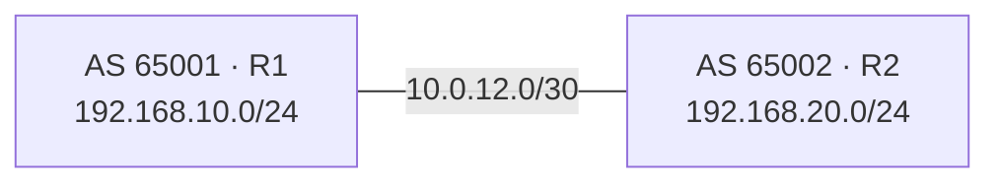

# 17 — MTCINE BGP: Policy Between Autonomous Systems

BGP is a path-vector Exterior Gateway Protocol. It exchanges reachability (NLRI) plus attributes and lets policy choose paths between autonomous systems. Use an IGP such as OSPF/IS-IS for normal internal topology; use BGP where policy, scale, multiple administrative domains, VPN families, or Internet exchange requires it.

## 1. Core terms

- **AS / ASN**: routers under one technical administration and policy, identified by an autonomous system number;
- **private ASN**: lab/internal ranges defined by standards; this book uses 65000–65534 for simple labs;
- **NLRI**: reachable prefix plus address-family context;
- **AS_PATH**: ordered AS sequence the route traversed, used for loop prevention and preference;
- **path attribute**: metadata such as NEXT_HOP, LOCAL_PREF, MED, ORIGIN, communities;
- **eBGP**: session between different ASNs;
- **iBGP**: session inside one ASN;
- **RIB/FIB**: routing candidates versus forwarding installation.

BGP uses TCP destination port 179. Peers exchange OPEN, KEEPALIVE, UPDATE, and NOTIFICATION messages. After the initial table exchange, updates are incremental rather than periodic full-table floods.

## 2. eBGP first lab

Topology:



R1:

```routeros
/routing bgp instance add name=as65001 as=65001 router-id=10.255.0.1
/routing bgp connection add name=to-r2 instance=as65001 \
    local.role=ebgp remote.address=10.0.12.2 remote.as=65002
```

R2 mirrors it with AS 65002, router ID `.2`, remote `10.0.12.1`, and remote AS 65001. `local.role` is mandatory in current RouterOS and also supports role-based leak-prevention semantics.

Verify transport/session before routes:

```routeros
/ping 10.0.12.2 src-address=10.0.12.1
/routing bgp connection print detail
/routing bgp session print detail
/log print where topics~"bgp"
```

An Established session proves TCP/OPEN negotiation, not that any prefix is accepted, best, or forwarded.

## 3. Originate one exact prefix

RouterOS `output.network` selects prefixes named in an IP firewall address list. The exact prefix must exist as an active route.

R1:

```routeros
/ip firewall address-list add list=bgp-originated address=192.168.10.0/24
/routing filter rule add chain=to-r2-out \
    rule="if (dst == 192.168.10.0/24) {accept} else {reject}"
/routing bgp connection set [find where name=to-r2] \
    output.network=bgp-originated output.filter-chain=to-r2-out
```

Why both list and filter:

- the address list selects candidate local networks;
- exact active-route matching prevents advertising an unreachable prefix;
- the output filter is an explicit policy guardrail;
- RouterOS routing filter chains reject unmatched routes, so every allowed case must accept explicitly.

If the aggregate must remain originated while component links change, install an intentional blackhole for the exact aggregate only after proving that discarding uncovered space is correct:

```routeros
/ip route add dst-address=192.168.10.0/24 blackhole distance=254 \
    comment="BGP aggregate existence/loop guard"
```

Do not advertise a public prefix you do not own or have authorization to announce.

## 4. Input filtering is mandatory

If R1 should accept only R2's `192.168.20.0/24`:

```routeros
/routing filter rule add chain=from-r2 \
    rule="if (dst == 192.168.20.0/24) {accept} else {reject}"
/routing bgp connection set [find where name=to-r2] input.filter=from-r2
```

Property names evolve; confirm with `?` on the target release and the generated CLI reference. Operationally, validate prefix, prefix length, AS path, communities, RPKI state where applicable, and maximum-prefix limits. Default-allow Internet BGP policy is unacceptable.

Check received/filtered routes:

```routeros
/routing route print detail where bgp
/routing route print detail where filtered
/routing bgp session print detail
```

## 5. Best-path selection in current RouterOS

Only valid reachable, loop-free, non-rejected routes in the same BGP instance enter BGP best-path comparison. Current RouterOS evaluates, in simplified order:

1. highest local-only **WEIGHT**;
2. highest **LOCAL_PREF** (default 100);
3. shortest **AS_PATH** unless configured to ignore length;
4. lowest **ORIGIN** type: IGP, then EGP, then incomplete;
5. lowest **MED**, normally compared among paths from the same neighboring AS;
6. eBGP over iBGP;
7. optional multipath equivalence point;
8. lowest IGP metric to next hop;
9. lowest router/originator ID;
10. shortest route-reflector cluster list;
11. lowest neighbor address.

Do not apply a memorized algorithm from another vendor/release when debugging. Print all relevant attributes and consult the current MikroTik selection documentation.

## 6. Attribute examples

### Prefer an exit inside your AS: LOCAL_PREF

```routeros
/routing filter rule add chain=from-isp1 \
    rule="if (dst in 0.0.0.0/0 && dst-len in 0-24) {set bgp-local-pref 200; accept} else {reject}"
```

LOCAL_PREF is distributed inside the AS and higher wins. Scope the match carefully; the example also rejects prefixes longer than `/24` for its lab policy.

### Influence inbound traffic: AS prepending

```routeros
/routing filter rule add chain=to-isp2 \
    rule="if (dst == 192.0.2.0/24) {set bgp-path-prepend 3; accept} else {reject}"
```

Prepending makes one advertisement's AS path longer and may make it less attractive to remote policy. It is a hint, not a guarantee; remote LOCAL_PREF can override path length.

### MED

Lower MED suggests a preferred entry point to a neighboring AS, with comparison rules/remote policy limitations. Use it only under an agreement with that neighbor.

### Communities

Communities label routes for policy. Standard communities are 32 bits; large communities are three 32-bit fields and work cleanly with 32-bit ASNs. The value means nothing unless both sides agree on semantics. Filter and document every community contract.

## 7. eBGP multihop and loopbacks

Direct eBGP expects a one-hop peer. Peering to loopbacks requires underlay reachability and multihop:

```routeros
/routing bgp connection add name=ebgp-loopback instance=as65001 \
    local.role=ebgp local.address=10.255.0.1 remote.address=10.255.0.2 \
    remote.as=65002 multihop=yes
```

The IGP/static routes to both loopbacks must work first. Protect TCP 179 by exact peer source and authentication where operationally agreed. Multihop expands the possible path and attack surface.

## 8. iBGP split horizon and next hop

iBGP does not add the local AS to AS_PATH and does not advertise an iBGP-learned route to another ordinary iBGP peer. Therefore, a full mesh of `n` routers requires `n(n-1)/2` sessions.

iBGP also commonly preserves the eBGP next hop. The IGP must resolve that next hop, or an appropriate `nexthop-choice=force-self` design must be used. A route can appear in BGP but remain invalid if NEXT_HOP is unreachable.

## 9. Route reflectors

A route reflector breaks iBGP full-mesh scaling by reflecting routes between clients while using ORIGINATOR_ID and CLUSTER_LIST to prevent reflection loops.

RR in AS 65000:

```routeros
/routing bgp instance add name=as65000 as=65000 router-id=10.255.0.1
/routing bgp connection add name=rr-listen instance=as65000 \
    local.address=10.255.0.1 local.role=ibgp-rr remote.address=10.255.0.0/24 \
    listen=yes multihop=yes
```

Client:

```routeros
/routing bgp instance add name=as65000 as=65000 router-id=10.255.0.11
/routing bgp connection add name=to-rr instance=as65000 local.role=ibgp \
    local.address=10.255.0.11 remote.address=10.255.0.1 multihop=yes
```

OSPF/IS-IS must already carry the loopbacks and external BGP next hops. In production, do not accept any source in a broad range without peer authentication, role/policy, maximum-prefix, and infrastructure filtering.

## 10. Confederations

A confederation divides one external AS into internal member sub-ASNs. Members use eBGP-like behavior internally while the outside sees the confederation identifier. Confederations can reduce full-mesh requirements and create policy boundaries, but add operational complexity. Route reflectors are more common for basic scale; know both because the official MTCINE objective names them.

## 11. Stub and transit scenarios

- Single-homed stub: usually receive only a default; advertise only owned aggregate.
- Dual-homed to one provider: use provider communities/MED/prepending as agreed, plus local failure policy.
- Multihomed to different providers: full or partial tables, strict filters, RPKI/IRR operational process, prefix limits, and resilient hardware/resources.
- Transit AS: intentionally carries routes between other ASes; accidental transit is a serious route leak.

Your export policy defines whether you are a stub or transit more than the topology does. Build “customer routes to peers/providers, peer/provider routes only to customers” policies explicitly.

## 12. Monitoring advertisements

RouterOS v7 does not retain all sent attributes by default because doing so consumes resources. For a controlled peer:

```routeros
/routing bgp connection set [find where name=to-r2] output.keep-sent-attributes=yes
/routing bgp session print
/routing bgp session dump-saved-advertisements [find where name~"to-r2"] \
    save-to=to-r2-output.pcap
```

Inspect the saved data through the relevant routing stats/PCAP workflow, then disable retention if unnecessary. Also verify from the peer's received table; local intended output is not the same as remote acceptance.

## 13. BGP troubleshooting ladder

1. underlay/loopback reachability and return path;
2. TCP 179/listener, firewall, source address, TTL/multihop;
3. OPEN: AS, role, capabilities, authentication;
4. session state/messages/notifications;
5. exact active originating route and `output.network` candidate;
6. output filter acceptance;
7. remote input filter/max-prefix;
8. received route validity: NEXT_HOP, AS loop, filter;
9. best-path attributes within the same instance;
10. FIB installation, policy table, firewall/NAT, and data-plane return.

## MTCINE BGP checkpoint

Build four routers: two providers and two routers in one customer AS. Demonstrate:

- eBGP and loopback iBGP;
- default plus one owned prefix with exact filters;
- LOCAL_PREF outbound choice and AS prepend inbound influence;
- invalid route caused by unreachable next hop;
- iBGP full-mesh rule, then replace with an RR;
- a prevented route leak using role/export policy;
- best-path explanation from printed attributes, not guesswork.
