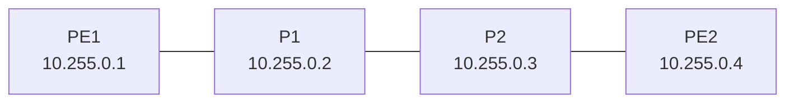

# 18 — MTCINE MPLS, LDP, VPLS, VRF/L3VPN and Traffic Engineering

MPLS forwards using labels between a service-provider edge and core. It does not automatically provide encryption. Its value is controlled forwarding and service separation, including pseudowires and BGP/MPLS Layer 3 VPNs.

## 1. Label fundamentals

An MPLS shim header is 32 bits:

- 20-bit label value;
- 3 traffic-class/EXP bits;
- 1 bottom-of-stack bit;
- 8-bit TTL.

Operations:

- **push**: ingress Label Edge Router adds a label;
- **swap**: Label Switch Router replaces top label for next hop;
- **pop**: egress removes label;
- **label stack**: an outer transport label can carry an inner service/VPN label.

A Forwarding Equivalence Class (FEC) groups traffic receiving the same label-forwarding treatment. The IP RIB/FIB must work before labels can sensibly follow it.

## 2. Static labels and LDP

Static label mappings teach the push/swap/pop data plane but do not scale operationally. LDP dynamically exchanges label bindings for IGP-reachable FECs. LDP is downstream unsolicited in common RouterOS operation: each router advertises its local binding to neighbors.

**Do not begin LDP until every provider loopback can reach every other loopback through the IGP.**

## 3. Four-router provider core



Use `/30` transits and `/32` loopbacks carried by OSPF area 0. Verify:

```routeros
/ping 10.255.0.4 src-address=10.255.0.1
/tool traceroute 10.255.0.4 src-address=10.255.0.1
/routing ospf neighbor print
/routing route print where ospf
```

## 4. Enable LDP only on core-facing links

PE1:

```routeros
/mpls ldp add afi=ip lsr-id=10.255.0.1 transport-addresses=10.255.0.1
/mpls ldp interface add interface=ether2
```

P routers add both core-facing interfaces; PE2 mirrors PE1. Do not enable LDP on customer-facing interfaces.

Verify control and data plane:

```routeros
/mpls ldp neighbor print detail
/mpls ldp local-mapping print detail
/mpls ldp remote-mapping print detail
/mpls forwarding-table print detail
/tool traceroute 10.255.0.4 src-address=10.255.0.1
```

- neighbor proves hello/session formation;
- local mapping is the label this router assigned to a FEC;
- remote mapping is a neighbor's advertised binding;
- forwarding table shows push/swap/pop decision;
- traceroute can reveal MPLS hops/labels depending on TTL propagation and responses.

## 5. Penultimate-hop popping

With PHP, the router before egress removes the transport label after receiving an implicit-null binding. The egress receives native IP or the remaining inner service label. PHP reduces egress work. Explicit-null can preserve MPLS QoS semantics to egress in designs that require it.

## 6. MTU and fragmentation

Every label adds 4 bytes. VPLS normally adds transport and pseudowire labels plus an encapsulated Ethernet frame; a control word can add 4 more bytes. Validate L2MTU along every core hop.

```routeros
/interface ethernet print detail
/mpls interface print detail
```

Do not validate only with 64-byte ping. Test maximum customer frames, multiple labels, VLAN tags, and failure paths. RouterOS VPLS control word can support pseudowire fragmentation/reassembly, but out-of-order fragment handling and performance constraints mean correct MTU remains preferable.

## 7. LDP-signaled VPLS

VPLS creates an Ethernet pseudowire between PEs over MPLS. A customer frame receives:

1. inner VPLS/service label identifying the pseudowire;
2. outer transport label reaching the remote PE.

On PE1:

```routeros
/interface vpls add name=vpls-cust-a peer=10.255.0.4 vpls-id=65000:100 \
    pw-control-word=enabled disabled=no
/interface bridge add name=br-cust-a protocol-mode=rstp
/interface bridge port add bridge=br-cust-a interface=ether3 comment="Customer A CE"
/interface bridge port add bridge=br-cust-a interface=vpls-cust-a horizon=100
```

PE2 uses peer `10.255.0.1` and the same VPLS ID. The VPLS ID must identify the same pseudowire at both ends. `horizon` helps split-horizon design in multipoint services; a two-site pseudowire still needs loop/MTU planning.

Verify:

```routeros
/interface vpls print detail
/interface vpls monitor vpls-cust-a once
/interface bridge host print where bridge=br-cust-a
/mpls forwarding-table print detail
```

A running pseudowire does not prove customer MAC learning, VLAN transparency, or MTU.

## 8. BGP-signaled VPLS

LDP VPLS requires explicit peers. MP-BGP can provide autodiscovery/signaling for multipoint VPLS and transport route-target extended communities. A provider iBGP design—commonly route reflectors—must already carry the relevant L2VPN family and maintain transport label reachability. Understand RD/RT policy before enabling discovery; a wrong import RT joins the wrong customer broadcast domain.

## 9. VRF fundamentals

A VRF creates a separate routing/forwarding context, allowing overlapping customer prefixes.

```routeros
/ip vrf add name=cust-a interfaces=ether3
/ip vrf add name=cust-b interfaces=ether4
/ip route print detail where routing-table=cust-a
```

VRF interface ordering matters: more specific assignments must precede broad/default matches according to current RouterOS behavior. Management tools and services need explicit VRF/source selection when operating outside main.

### RD versus RT

- **Route Distinguisher (RD)** makes otherwise identical customer prefixes unique in VPNv4/v6 NLRI. It does not define who imports the route.
- **Route Target (RT)** is an extended community controlling import/export membership. It defines VPN policy.

Two customers can both use `192.168.1.0/24`; different RDs distinguish their VPN routes, and RTs ensure each VRF imports only intended routes.

## 10. BGP/MPLS Layer 3 VPN

On a PE, a current RouterOS v7 VPN object conceptually binds a VRF to RD/RT and exported routes:

```routeros
/routing bgp vpn add vrf=cust-a route-distinguisher=10.255.0.1:100 \
    export.route-targets=65000:100 import.route-targets=65000:100 \
    export.redistribute=connected
```

Provider MP-BGP peers exchange the VPNv4 family, while MPLS transports labeled packets between PEs. Exact connection property names for address families must be confirmed on the target version:

```routeros
/routing bgp connection print detail
/routing route print detail where afi=vpnv4
/mpls forwarding-table print detail
/ip route print detail where routing-table=cust-a
```

Never broadly export connected routes from a PE without limiting which VRF/customer routes are intended. RT import mistakes can leak one customer's routes into another.

## 11. CE–PE routing and OSPF

The CE and PE can use static, OSPF, or BGP per VRF. When OSPF is used across a Layer 3 VPN, the provider must preserve correct domain/tag/DN-bit behavior to prevent routes learned from the VPN from being re-advertised back into it as new external information. Test route type/metric/tag and loop prevention, not only reachability.

## 12. Route leaking

VRF privacy is default intent. Controlled leaking may be needed for shared services. Prefer explicit BGP import/export RT policy; static inter-table routes are a narrow alternative. Document source VRF, destination VRF, exact prefixes, return path, firewall, and whether NAT is required. An overbroad RT is a tenant-isolation incident.

## 13. Traffic Engineering and RSVP-TE

Ordinary LDP follows the IGP shortest path. RSVP-TE can establish an explicitly routed or constraint-based Label Switched Path.

Terms:

- RSVP: signals resource reservation/path state;
- CSPF: computes a path satisfying constraints such as bandwidth/affinity;
- static path: operator specifies strict/loose hops;
- dynamic path: router computes a path from topology/TE information;
- setup priority: ability to preempt another LSP during establishment;
- holding priority: resistance to later preemption;
- affinity/resource class: colored constraints;
- reoptimization: move to a better eligible path after topology changes.

Conceptual RouterOS interface, after creating a CSPF-enabled TE path object named `dyn` for the running RouterOS release:

```routeros
/interface traffic-eng add name=te-pe1-pe2 from-address=10.255.0.1 \
    to-address=10.255.0.4 bandwidth=50M primary-path=dyn \
    record-route=yes disabled=no
/interface traffic-eng monitor te-pe1-pe2 once
```

Path objects and OSPF TE information must exist. Use `?` and the current TE manual to define dynamic/static paths for the running release.

### Reservation is not rate limiting

`bandwidth=50M` reserves/signals TE resources for path calculation. It does not necessarily police customer traffic to 50 Mbps. `bandwidth-limit`/queues are separate enforcement mechanisms. Confusing admission control with shaping is a central MTCINE objective.

## 14. MPLS QoS

The 3-bit EXP/traffic-class field carries eight values. RouterOS maps ingress priority/priority through label operations. Since RouterOS v7.17, `/mpls mangle` can match/change EXP and assign marks; interface-parent Queue Trees can act on MPLS traffic. Simple queues/global IMQ are not the same path. Design classification at edges, core behavior, PHP/explicit-null, and congestion scheduling as one system.

## 15. MPLS incident workflow

For “VPLS down”:

1. physical/core IP and OSPF reachability;
2. loopback-to-loopback source ping;
3. LDP discovery/session and label mappings;
4. transport label in forwarding table;
5. VPLS peer ID/control-word/pseudowire state;
6. bridge port/state/MAC learning and split horizon;
7. L2MTU across primary and backup paths;
8. customer VLAN/frame behavior and loop;
9. capture/monitor imposed labels.

For “L3VPN leak”:

1. freeze changes;
2. identify affected VRFs/prefixes;
3. inspect RD/RT export/import and BGP filters;
4. remove erroneous import/export safely;
5. verify VPNv4 withdraw and VRF FIB;
6. test customer isolation and record security impact.

## MTCINE MPLS checkpoint

Build a PE–P–P–PE lab and prove:

- end-to-end IGP before LDP;
- local/remote labels, swap and PHP;
- LDP VPLS with bridge MAC learning and two-label forwarding;
- failure caused by L2MTU;
- two VRFs with overlapping prefixes and correct isolation;
- one controlled L3VPN using RD/RT;
- TE path reservation versus queue-enforced rate;
- rollback from a deliberately wrong route target.
